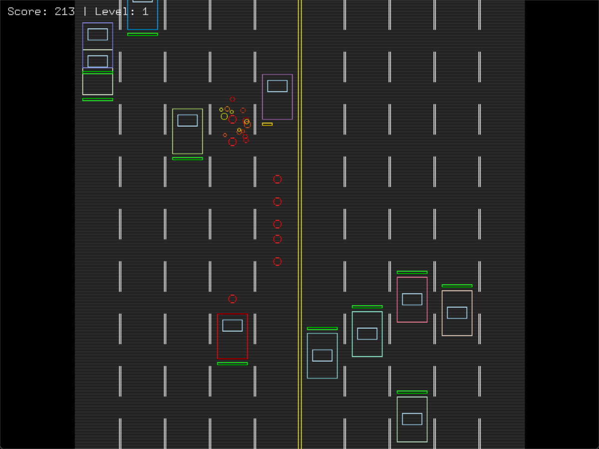

# Car Destroyer

A two-way-traffic arcade shooter written in Python with legacy OpenGL and GLUT. You weave through ten lanes of traffic, shoot enemy cars, and survive boss vehicles that fire back, alone or head-to-head with a second player on the same keyboard. Every shape on screen is rasterised point by point with the midpoint line and circle algorithms, not OpenGL's built-in primitives; only text uses GLUT bitmap fonts.



## Features

- **Single-player and local two-player modes:** a red car for player 1 and a blue car for player 2, each with its own score.
- **Two-way traffic:** ten lanes split by a centre divider, with random spawns and safe-distance spacing between cars.
- **Boss vehicles:** 10 hit points, larger and red, and they aim and fire at the nearest player on a cooldown.
- **Health bars:** above every vehicle, shifting from green to yellow to red as health drops.
- **Particle explosions:** randomised direction, colour, size and fade-out.
- **Difficulty scaling:** every 1,000 points, traffic density (30% → 60%), vehicle speed and boss frequency all increase.
- **Scoring:** 150 per car, 1,000 per boss, plus points for survival time.
- **Menus:** a pause menu (resume, restart, exit to menu) and a game-over screen that names the winner in two-player mode.

## Controls

| | Player 1 | Player 2 |
|---|---|---|
| Move | `W` `A` `S` `D` | Arrow keys |
| Shoot | `Space` | `End` |
| Pause | `P` | `P` |

Use `W` / `S` and `Enter` to navigate menus.

## Graphics techniques

| Technique | Where it's used |
|---|---|
| Midpoint (Bresenham-style) line algorithm, handling steep and reversed lines | Cars, lane markers, road edges, health bars |
| Midpoint circle algorithm | Bullets and explosion particles |
| Timer-driven game loop (`glutTimerFunc`) | Fixed-step updates for movement, spawning and collisions |
| Axis-aligned bounding-box collision | Bullets vs. cars, cars vs. players |
| Alpha blending | Explosion fade-out, pause and game-over overlays |

## Tech stack

Python 3 · PyOpenGL (GL, GLU, GLUT)

## Running locally

```bash
git clone https://github.com/aksaN000/car-destroyer-opengl.git
cd car-destroyer-opengl
pip install -r requirements.txt
python car_destroyer.py
```

On Windows, the PyOpenGL wheel ships with GLUT. On Linux, also install freeglut (`sudo apt install freeglut3-dev`).

## Project structure

```text
car_destroyer.py      the game
labs/                 earlier OpenGL lab work
  hello_opengl.py         first window and points
  lab1_house_and_rain.py  a house scene with animated rain that you can steer
  lab2_circle_shooter.py  a shooter game built on midpoint lines and circles
  shapes_and_camera.py    shapes, axes and camera/mouse listeners
docs/screenshot.png
```

Built for CSE423 (Computer Graphics) at BRAC University, Fall 2024.
